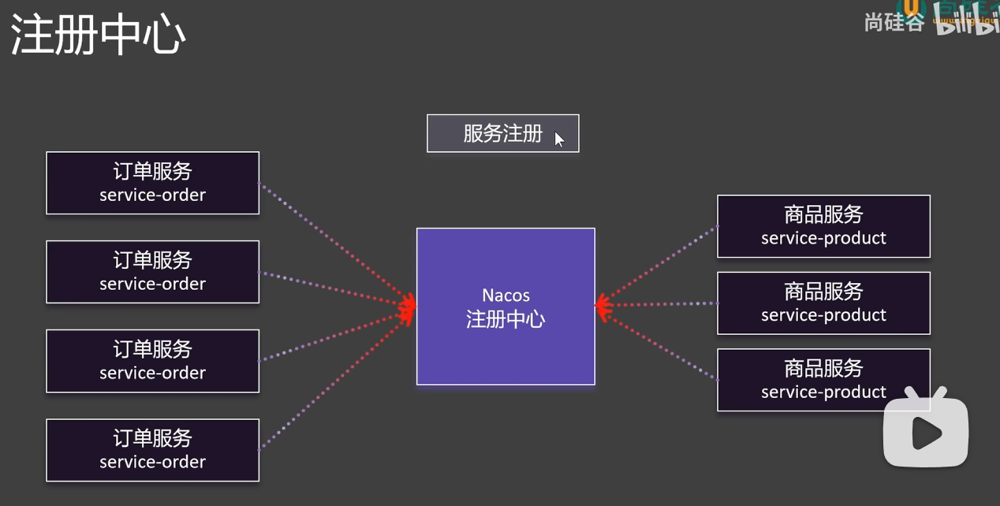

## Nacos安装
nacos是注册中心，服务启动时，会向nacos注册，nacos会记录服务的地址，服务下线时，会从nacos中删除服务地址。

在如下地址下载nacos最新稳定安装包，执行`startup.cmd -m standalone`命令启动nacos服务

`https://nacos.io/download/nacos-server/?spm=5238cd80.2ef5001f.0.0.3f613b7cP2yWjq`

`进入D:\OA\AutoCode\nacos-server-2.4.3\nacos\bin目录执行启动命令启动nacos服务`

启动成功后，访问http://localhost:8848/nacos/index.html，默认用户名和密码都是nacos