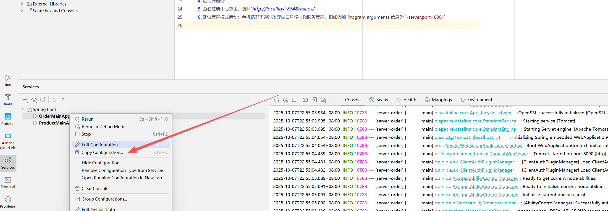

### Nacos-注册中心-服务注册：


1. 引入`spring-boot-starter-web`、`spring-cloud-starter-alibaba-nacos-discovery`依赖
```
<!-- Nacos服务发现 -->
        <dependency>
            <groupId>com.alibaba.cloud</groupId>
            <artifactId>spring-cloud-starter-alibaba-nacos-discovery</artifactId>
        </dependency>
```
2. 编写主启动类(服务的启动类)，编写配置文件
3. 配置 Naocs 地址
    ```
   spring.cloud.nacos.server-addr=127.0.0.1:8848
    ```
4. 启动微服务
5. 查看注册中心效果，访问`http://localhost:8848/nacos/`  
6. 测试集群模式启动：单机情况下通过改变端口号模拟微服务集群，例如添加 Program arguments 信息为 `--server.port=8001`
