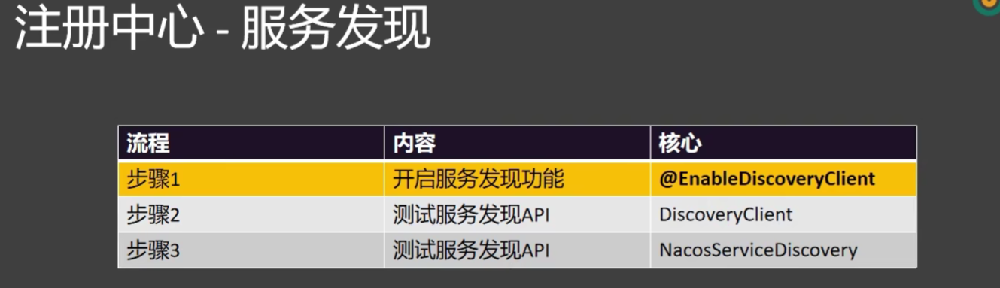

## Nacos服务发现
将服务主程序使用@EnableDiscoveryClient注解开启服务发现功能，服务发现的API会被封装为自动化代码

使用方法主要是使用DiscoveryClient、NacosServiceDiscovery

获取服务列表“.getServices()”

获取服务实例列表“.getInstances(serviceName)”

编写测试类测试服务发现组件，单元测试类需要和启动类在同一目录下
```java
    @Autowired
    DiscoveryClient discoveryClient;

    @Autowired
    NacosServiceDiscovery nacosServiceDiscovery;

    @Test
    void nacosServiceDiscoveryTest() throws NacosException {
        for(String service : nacosServiceDiscovery.getServices()){
            List<ServiceInstance> instances = nacosServiceDiscovery.getInstances(service);
            System.out.println("service: " + service);

            instances.forEach(instance -> {
                System.out.println("host: " + instance.getHost() + ", port: " + instance.getPort());
            });
        }
    }
    @Test
    void DiscoveryClientTest() {

        for (String service : discoveryClient.getServices()) {
            System.out.println("service: " + service);

            List<ServiceInstance> instances = discoveryClient.getInstances(service);
            // 获取ip+port
            instances.forEach(instance -> {
                System.out.println("host: " + instance.getHost() + ", port: " + instance.getPort());
            });
        }

    }

 ```


