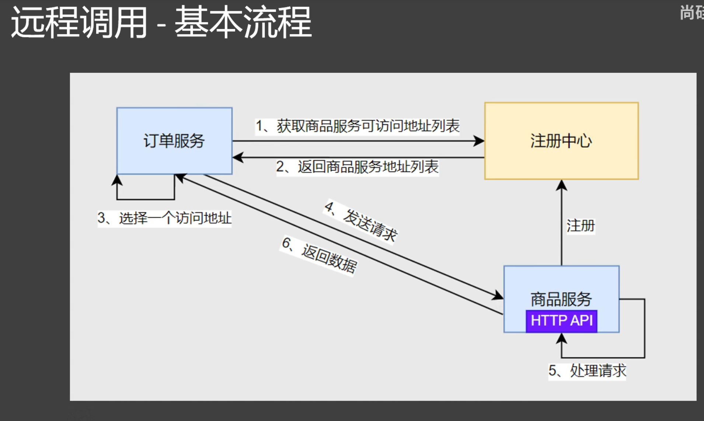
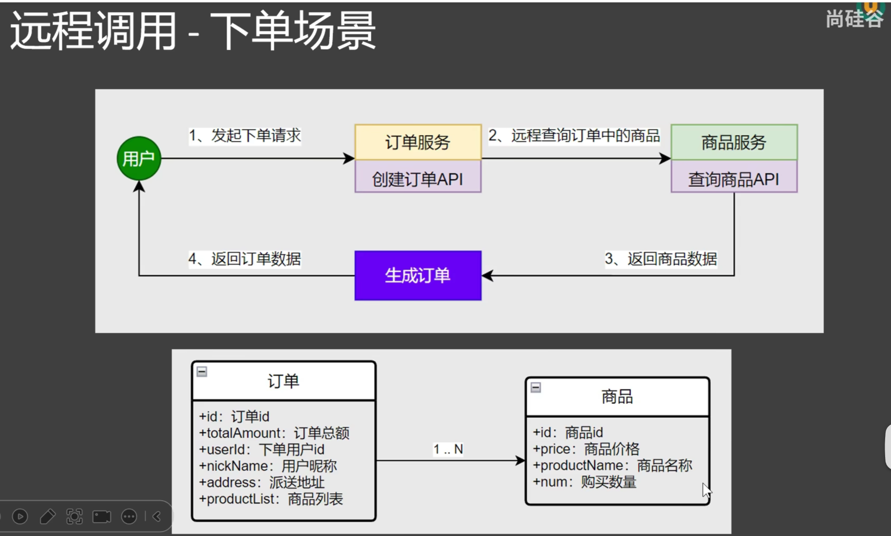

## 微服务API



### 用户下单案例



使用@Configuration注解创建 一个配置类，并使用@Bean注解，创建一个RestTemplate对象，并返回。
RestTemplate的作用是用来发送REST请求。
@LoadBalanced注解：使用@LoadBalanced注解，创建RestTemplate对象时，会自动使用负载均衡策略。
```java
@Configuration
public class RestConfig {
    @Bean
    @LoadBalanced
    public RestTemplate restTemplate() {
        return new RestTemplate();
    }
}

/**
     * 基于注解式负载均衡
     * @param id
     * @return
     */
    public Product getRemoteProduct(Long id) {
        //获取到商品服务所在的所有机器IP+port
        String url ="http://service-product/product/getProduct/" + id;

        Product product = restTemplate.getForObject(url, Product.class);
        log.info("调用商品服务成功，返回数据：{}", product);
        return product;
    }
```
创建一个OrderController类，并使用@RestController注解，创建一个订单服务。
```java
@RestController
public class OrderController {

    @Autowired
    OrderService orderService;
    /**
     * 创建订单
     */
    @GetMapping("/create")
    public Order createOrder(@RequestParam("userId") Long userId, @RequestParam("productId") Long productId) {
        return orderService.createOrder(userId,productId);
    }
}

```
Service接口  
```java
public interface OrderService {
    Order createOrder(Long userid, Long productId);
}
```
Service实现类
```java

@Slf4j
@Service
public class OrderServiceImpl implements OrderService {

    @Autowired
    DiscoveryClient discoveryClient;

    @Autowired
    LoadBalancerClient loadBalancerClient;
    @Autowired
    RestTemplate restTemplate;
    @Override
    public Order createOrder(Long userid, Long productId) {
        Order Order = new Order();
        Order.setUserid(userid);
        Order.setNickName("fanwei");
        Order.setAddress("beijing");
//        Product product = getRemoteProductByid(productId);
//        Product product = getRemoteProductByidWithLoadBalance(productId);
        //基于注解式负载均衡
        Product product = getRemoteProduct(productId);
        // 使用 BigDecimal.multiply 进行精确计算
        BigDecimal price = product.getPrice();
        BigDecimal num = BigDecimal.valueOf(product.getNum());
        Order.setTotalAmount(price.multiply( num));
        Order.setProductList(Arrays.asList( product));
        return Order;
    }

    public Product getRemoteProductByid(Long id) {
        //获取到商品服务所在的所有机器IP+port
        List<ServiceInstance> instances = discoveryClient.getInstances("service-product");
        String url ="http://" + instances.get(0).getHost() + ":" + instances.get(0).getPort();

        Product product = restTemplate.getForObject(  url+"/product/getProduct/" + id, Product.class);
        log.info("调用商品服务成功，返回数据：{}", product);
        return product;
    }

    /**
     * 基于注解式负载均衡
     * @param id
     * @return
     */
    public Product getRemoteProduct(Long id) {
        //获取到商品服务所在的所有机器IP+port
        String url ="http://service-product/product/getProduct/" + id;

        Product product = restTemplate.getForObject(  url, Product.class);
        log.info("调用商品服务成功，返回数据：{}", product);
        return product;
    }

    /**
     * 负载均衡地调用
     * @param id
     * @return
     */
    public Product getRemoteProductByidWithLoadBalance(Long id) {
        //获取到商品服务所在的所有机器IP+port
        ServiceInstance serviceInstance = loadBalancerClient.choose("service-product");
        String url ="http://" + serviceInstance.getHost() + ":" + serviceInstance.getPort()+"/product/getProduct/" + id;

        Product product = restTemplate.getForObject(url, Product.class);
        log.info("调用商品服务成功，返回数据：{}", product);
        return product;
    }
}

``` 