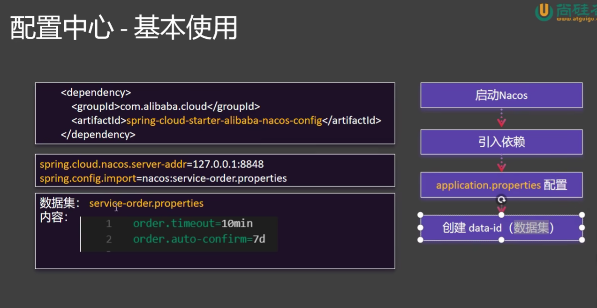

## Nacos配置中心
在大型分布式系统中, 配置文件一般都是放在配置中心中, 比如Spring Cloud Alibaba中的Nacos。配置中心可以统一管理配置文件, 配置文件更新时, 无需重启服务, 配置文件更新时, 无需重启服务。
使用nacos配置中心可以做到不停机更新, 同时也可以做到配置的版本管理。

配置中心的动态刷新步骤：

@Value("${xx}") 获取配置 + @RefreshScope 实现动态刷新
@ConfigurationProperties 无感自动刷新
NacosConfigManager 监听配置变化
如果存在多个相同的配置信息，那么
