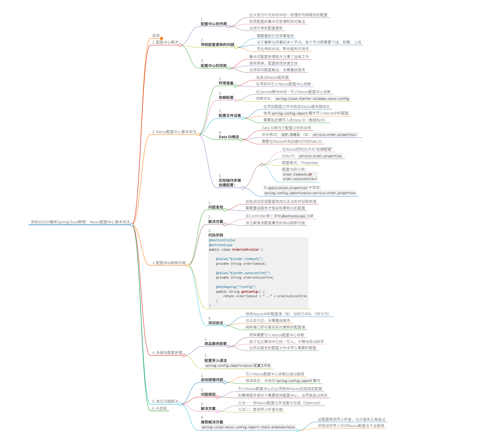

# 尚硅谷2025最新SpringCloud教程：Nacos配置中心基本用法


## 目录
- [1. 配置中心概述](#1-配置中心概述)
- [2. Nacos配置中心基本用法](#2-nacos配置中心基本用法)
- [3. 配置自动刷新功能](#3-配置自动刷新功能)
- [4. 多服务配置管理](#4-多服务配置管理)
- [5. 常见问题解决](#5-常见问题解决)
- [6. AI总结](#6-ai总结)

## 1. 配置中心概述

1. **配置中心的作用**
   - 在大型分布式系统中统一管理所有微服务的配置
   - 实现配置的集中式管理和实时推送
   - 支持不停机配置更新

2. **传统配置更新的问题**
   - 需要重新打包部署服务
   - 对于集群化部署的多个节点，每个节点都需要下线、部署、上线
   - 存在停机时间，影响服务可用性

3. **配置中心的优势**
   - 集中式配置管理极大方便了运维工作
   - 使用简单，配置修改快速生效
   - 支持实时配置推送，无需重启服务

*Screenshot-[00:20]*

## 2. Nacos配置中心基本用法

1. **环境准备**
   - 先启动Nacos服务器
   - 在项目中引入Nacos配置中心依赖

2. **依赖配置**
   - 在Service模块中统一引入Nacos配置中心依赖
   - 依赖坐标：`spring-cloud-starter-alibaba-nacos-config`
```java
 <dependency>
    <groupId>com.alibaba.cloud</groupId>
    <artifactId>spring-cloud-starter-alibaba-nacos-config</artifactId>
</dependency>
```

3. **配置文件设置**
   - 在项目配置文件中指定Nacos服务器地址
   - 使用`spring.config.import`属性导入Nacos中的配置
   - 需要指定要导入的Data ID（数据标识）

4. **Data ID概念**
   - Data ID相当于配置文件的名称
   - 命名格式：`名称.后缀名`（如：`service-order.properties`）
   - 需要在Nacos中先创建对应的Data ID

5. **实际操作步骤**

   **创建配置：**
   - 在Nacos控制台点击"创建配置"
   - Data ID：`service-order.properties`
   - 配置格式：Properties
   - 配置内容示例：
     ```
     order.timeout=30
     order.autoconfirm=7
     ```

   **项目配置：**
   - 在`application.properties`中添加：
     ```properties
     spring.config.import=nacos:service-order.properties
     ```

   **代码中使用配置：**
   ```java
   @Value("${order.timeout}")
   private String orderTimeout;
   
   @Value("${order.autoconfirm}") 
   private String orderAutoconfirm;
   ```

*Screenshot-[02:05]*

## 3. 配置自动刷新功能

1. **问题发现**
   - 初始测试发现配置修改后无法实时获取新值
   - 需要重启服务才能获取更新后的配置

2. **解决方案**
   - 在Controller类上添加`@RefreshScope`注解
   - 该注解激活配置属性的自动刷新功能

3. **代码示例**
   ```java
   @RestController
   @RefreshScope
   public class OrderController {
       
       @Value("${order.timeout}")
       private String orderTimeout;
       
       @Value("${order.autoconfirm}")
       private String orderAutoconfirm;
       
       @GetMapping("/config")
       public String getConfig() {
           return orderTimeout + " - " + orderAutoconfirm;
       }
   }
   ```

4. **测试验证**
   - 修改Nacos中的配置值（如：30改为300，7改为70）
   - 点击发布后，无需重启服务
   - 刷新接口即可看到实时更新的配置值

*Screenshot-[04:50]*

## 4. 多服务配置管理

1. **商品服务配置**
   - 同样需要引入Nacos配置中心依赖
   - 由于在父模块中已统一引入，子模块自动继承
   - 在商品服务的配置文件中导入需要的配置

2. **配置导入语法**
   ```properties
   spring.config.import=nacos:配置文件名
   ```

## 5. 常见问题解决

1. **启动报错问题**
   - 引入Nacos配置中心依赖后启动报错
   - 错误信息：未指定`spring.config.import`属性

2. **问题原因**
   - 引入Nacos配置中心后必须使用Nacos前缀指定配置
   - 如果微服务暂时不需要使用配置中心，会导致启动失败

3. **解决方案**
   - 方法一：将Nacos配置文件设置为可选（Optional）
   - 方法二：禁用导入检查功能

4. **推荐解决方案**
   ```properties
   spring.cloud.nacos.config.import-check.enabled=false
   ```
   - 此配置禁用导入检查，允许服务正常启动
   - 即使没有导入任何Nacos配置也不会报错

*Screenshot-[06:20]*

## 6. AI总结

本视频详细介绍了Nacos配置中心的基本使用方法。配置中心在分布式系统中起到统一管理配置的作用，支持配置的实时推送和不停机更新。核心步骤包括：引入Nacos配置中心依赖、在Nacos控制台创建配置Data ID、在项目中导入配置、使用`@Value`注解获取配置值。为了实现配置的自动刷新，需要在Controller上添加`@RefreshScope`注解。对于暂时不需要使用配置中心的服务，可以通过设置`spring.cloud.nacos.config.import-check.enabled=false`来避免启动报错。Nacos配置中心的使用大大简化了微服务架构中的配置管理，提高了系统的可维护性和灵活性。