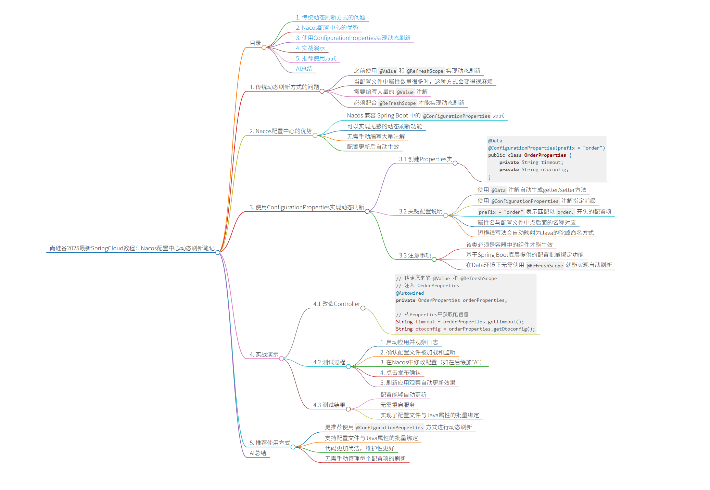

# 尚硅谷2025最新SpringCloud教程：Nacos配置中心动态刷新笔记


## 目录
- [1. 传统动态刷新方式的问题](#1-传统动态刷新方式的问题)
- [2. Nacos配置中心的优势](#2-nacos配置中心的优势)
- [3. 使用ConfigurationProperties实现动态刷新](#3-使用configurationproperties实现动态刷新)
- [4. 实战演示](#4-实战演示)
- [5. 推荐使用方式](#5-推荐使用方式)
- [AI总结](#ai总结)

## 1. 传统动态刷新方式的问题

- 之前使用 `@Value` 和 `@RefreshScope` 实现动态刷新
- 当配置文件中属性数量很多时，这种方式会变得很麻烦
- 需要编写大量的 `@Value` 注解
- 必须配合 `@RefreshScope` 才能实现动态刷新

## 2. Nacos配置中心的优势

- Nacos 兼容 Spring Boot 中的 `@ConfigurationProperties` 方式
- 可以实现无感的动态刷新功能
- 无需手动编写大量注解
- 配置更新后自动生效

## 3. 使用ConfigurationProperties实现动态刷新

### 3.1 创建Properties类

```java
@Data
@ConfigurationProperties(prefix = "order")
public class OrderProperties {
    private String timeout;
    private String otoconfig;
}
```

### 3.2 关键配置说明

- 使用 `@Data` 注解自动生成getter/setter方法
- 使用 `@ConfigurationProperties` 注解指定前缀
- `prefix = "order"` 表示匹配以 `order.` 开头的配置项
- 属性名与配置文件中点后面的名称对应
- 短横线写法会自动映射为Java的驼峰命名方式

### 3.3 注意事项

- 该类必须是容器中的组件才能生效
- 基于Spring Boot底层提供的配置批量绑定功能
- 在Data环境下无需使用 `@RefreshScope` 就能实现自动刷新

## 4. 实战演示

### 4.1 改造Controller

```java
// 移除原来的 @Value 和 @RefreshScope
// 注入 OrderProperties
@Autowired
private OrderProperties orderProperties;

// 从Properties中获取配置值
String timeout = orderProperties.getTimeout();
String otoconfig = orderProperties.getOtoconfig();
```

### 4.2 测试过程

1. 启动应用并观察日志
2. 确认配置文件被加载和监听
3. 在Nacos中修改配置（如在后缀加"A"）
4. 点击发布确认
5. 刷新应用观察自动更新效果

### 4.3 测试结果

- 配置能够自动更新
- 无需重启服务
- 实现了配置文件与Java属性的批量绑定

## 5. 推荐使用方式

- 更推荐使用 `@ConfigurationProperties` 方式进行动态刷新
- 支持配置文件与Java属性的批量绑定
- 代码更加简洁，维护性更好
- 无需手动管理每个配置项的刷新

## AI总结

本视频主要介绍了Nacos配置中心中更优雅的动态刷新实现方式。相比传统的`@Value` + `@RefreshScope`组合，使用`@ConfigurationProperties`注解可以实现无感的配置批量绑定和动态刷新，大大简化了代码编写和维护工作。这种方式特别适合配置项较多的场景，能够自动将配置文件中的属性映射到Java对象中，并在配置变更时自动更新，是生产环境中推荐的配置管理方式。