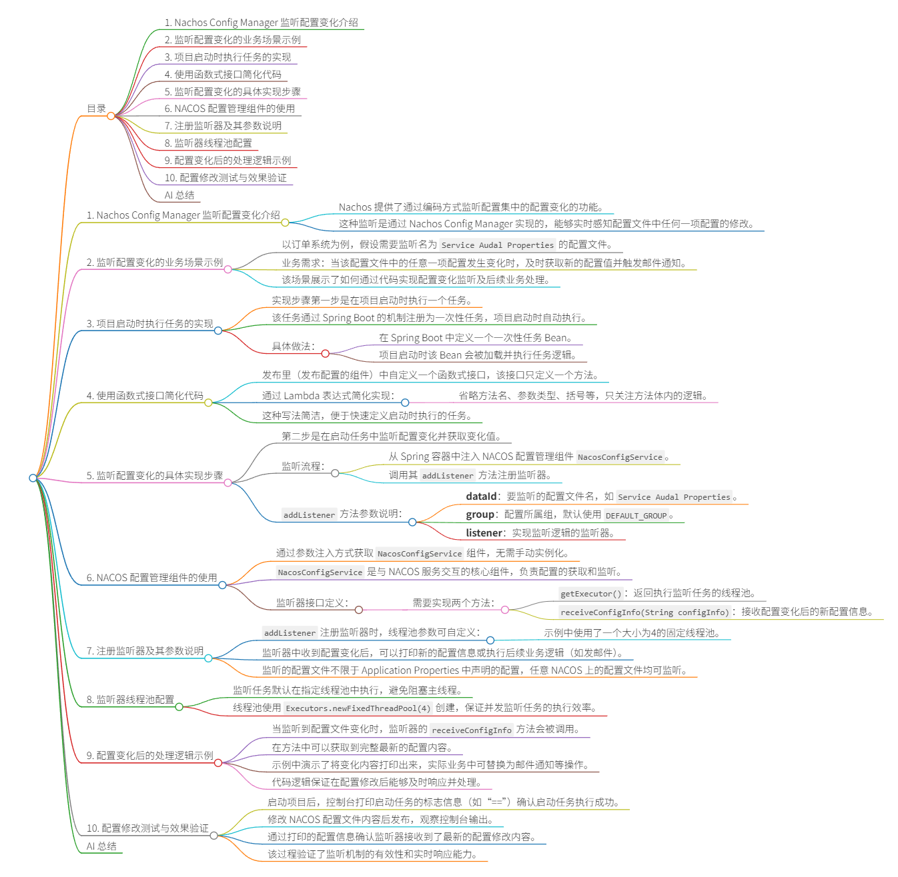

# 目录
- [1. 概述](#1-概述)
- [2. 实现步骤](#2-实现步骤)
- [3. 详细实现过程](#3-详细实现过程)
- [4. 测试验证](#4-测试验证)
- [5. AI 总结](#5-ai-总结)

## 1. 概述

Nacos 提供了一种通过编码方式监听配置集中配置变化的方法，使用 **Nacos Config Manager** 组件可以实现实时配置监控。

**应用场景示例**：
- 当 Nacos 中 `service-audal-properties` 配置文件发生变化时
- 获取变化后的新配置值
- 发送邮件通知

## 2. 实现步骤

1\. **项目启动时监听配置变化**
2\. **监听配置文件变化**
3\. **获取变化的值**
4\. **发送邮件**

## 3. 详细实现过程

### 3.1 项目启动机制

使用 Spring Boot 的 `CommandLineRunner` 实现一次性任务：

```java
@Bean
public CommandLineRunner commandLineRunner() {
    return args -> {
        // 项目启动时执行的任务
        System.out.println("======== 启动项目 ========");
    };
}
```

**简化写法**：使用 Lambda 表达式
- 省略方法声明和方法名
- 直接写方法参数表和方法体
- 使用箭头函数

### 3.2 监听配置变化

从容器中获取 `NacosConfigManager` 组件：

```java
@Bean
public CommandLineRunner commandLineRunner(NacosConfigManager configManager) {
    return args -> {
        // 获取配置服务
        ConfigService configService = configManager.getConfigService();
        
        // 添加监听器
        configService.addListener(
            "dataId",           // 数据集ID - 要监控的配置文件
            "DEFAULT_GROUP",    // 组名 - 默认 DEFAULT_GROUP
            new Listener() {
                @Override
                public Executor getExecutor() {
                    // 监听任务在线程池中运行
                    return Executors.newFixedThreadPool(4);
                }
                
                @Override
                public void receiveConfigInfo(String configInfo) {
                    // 接收配置信息
                    // 所有变化的配置在此获取
                    System.out.println("变化的配置信息：" + configInfo);
                    
                    // 在此处进行邮件通知
                    // sendEmail(configInfo);
                }
            }
        );
    };
}
```

### 3.3 关键参数说明

- **dataId**：要监控的 Nacos 配置文件 ID
  - 可以监控任意配置文件，不限于 `application.properties` 中导入的
- **group**：配置组名
  - 默认组：`DEFAULT_GROUP`
- **Listener**：配置变化监听器
  - `getExecutor()`：指定线程池执行监听任务
  - `receiveConfigInfo()`：接收变化的配置信息

## 4. 测试验证

### 4.1 启动验证
项目启动成功后，控制台会打印等号标记，确认任务已执行。

### 4.2 配置修改测试
1. 在 Nacos 中编辑配置文件
2. 在配置值后添加内容（如添加 "BV"）
3. 点击发布
4. 观察控制台输出

### 4.3 输出结果
监听器会返回完整的配置变化信息：
- `oldValue = 最新的值`
- `newAutoConfig = 最新的值`

可以通过这些信息生成完整的邮件通知内容。

## 5. AI 总结

本教程详细介绍了如何使用 Nacos Config Manager 通过编码方式实现配置变化的实时监听。核心要点包括：

1. **启动机制**：利用 Spring Boot 的 CommandLineRunner 在项目启动时自动执行监听任务
2. **监听配置**：通过 Nacos Config Service 的 addListener 方法添加配置变化监听器
3. **参数配置**：需要指定 dataId（配置文件ID）、group（组名）和 Listener（监听器）
4. **异步处理**：监听任务在独立线程池中运行，不影响主线程性能
5. **实时响应**：配置发生变化时立即触发 receiveConfigInfo 方法，可在此处实现业务逻辑

这种方法适用于需要实时响应配置变化的场景，如动态调整系统参数、实时通知配置变更等需求。