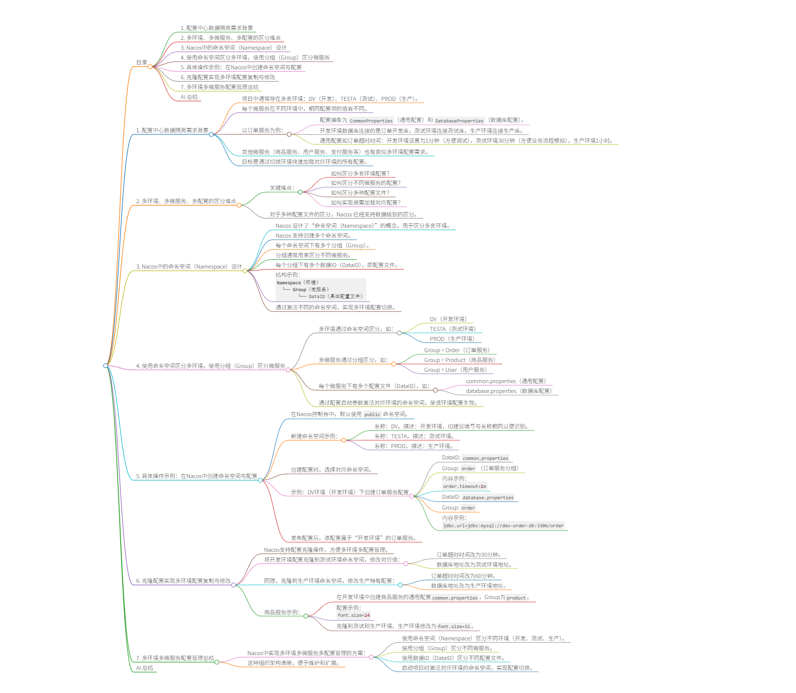

# 17、Nacos - 配置中心 - 数据隔离 - namespace区分多环境


## 目录
- [1. 需求场景](#1-需求场景)
- [2. 难点分析](#2-难点分析)
- [3. Nacos 设计架构](#3-nacos-设计架构)
- [4. 项目环境绑定机制](#4-项目环境绑定机制)
- [5. 实现步骤详解](#5-实现步骤详解)
- [6. 配置管理操作](#6-配置管理操作)
- [7. 架构总结](#7-架构总结)
- [AI 总结](#ai-总结)

## 1. 需求场景
- 项目需要支持多套环境：DEV（开发）、TESTA（测试）、PROD（生产）
- 每个微服务在不同环境中的配置值各不相同
- 以订单服务为例：
  - 配置分为 `CommonProperties`（通用配置）和 `DatabaseProperties`（数据库配置）
  - 开发环境：数据库连接开发库，超时时间设为1分钟
  - 测试环境：数据库连接测试库，超时时间设为30分钟  
  - 生产环境：数据库连接生产库，超时时间设为1小时
- 其他微服务（商品、用户、支付等）同样需要适配多环境配置
- 目标：通过环境切换快速加载对应环境的完整配置

## 2. 难点分析
- 如何区分多套环境
- 如何区分多种微服务  
- 如何区分多种配置类型
- 如何实现按需加载配置
- 现有能力：通过Nacos的DataID已能区分多种配置

## 3. Nacos 设计架构
- **Namespace（名称空间）**：用于区分多套环境
  - 每个Namespace代表一套独立的环境配置
- **Group（分组）**：用于区分多种微服务
  - 例如：Order组代表订单服务，Product组代表商品服务
- **DataID（数据ID）**：用于区分多种配置
  - 例如：`common.properties`、`database.properties`
- 层级关系：
  - Namespace → Group → DataID → 具体配置项
- 默认配置：未创建Namespace时使用Public名称空间和默认分组

## 4. 项目环境绑定机制
- 在项目中定义多环境配置能力
- 环境与Namespace绑定关系：
  - 开发环境 → DEV Namespace
  - 测试环境 → TESTA Namespace  
  - 生产环境 → PROD Namespace
- 通过激活指定环境来加载对应Namespace下的所有配置
- 使用Spring Boot的profile激活机制实现环境切换

## 5. 实现步骤详解

### 5.1 创建Namespace
- 在Nacos控制台进入"命名空间"
- 点击"新建命名空间"
- 创建三个Namespace：
  - **DEV**：ID设为"dev"，描述"开发"
  - **TESTA**：ID设为"testa"，描述"测试"  
  - **PROD**：ID设为"prod"，描述"生产"
- 注意：不创建Namespace时默认使用Public

### 5.2 配置组织结构规划
- 每个Namespace下按Group区分微服务
- 每个Group下包含多个DataID配置文件
- 示例结构：
  - DEV Namespace
    - Order Group
      - common.properties
      - database.properties
    - Product Group  
      - common.properties
  - TESTA Namespace
    - Order Group
      - common.properties
      - database.properties

## 6. 配置管理操作

### 6.1 开发环境配置创建
- 进入DEV Namespace
- 创建订单服务配置：
  - **DataID**: `common.properties`
    - Group: `order`
    - 配置内容：
      ```properties
      order.timeout=1m
      order.timeout.confirm=1h
      ```
  - **DataID**: `database.properties`  
    - Group: `order`
    - 配置内容：
      ```properties
      db.url=order_db_dev
      ```

### 6.2 测试环境配置克隆与修改
- 选中开发环境的两个配置
- 点击"克隆"到TESTA Namespace
- 修改配置值：
  - `common.properties`:
    ```properties
    order.timeout=30m
    order.timeout.confirm=3h
    ```
  - `database.properties`:
    ```properties  
    db.url=order_db_test
    ```

### 6.3 生产环境配置配置
- 同样使用克隆方式创建PROD Namespace配置
- 修改配置值：
  - `common.properties`:
    ```properties
    order.timeout=60m
    order.timeout.confirm=7h
    ```
  - `database.properties`:
    ```properties
    db.url=order_db_prod
    ```

### 6.4 商品服务配置示例
- 在DEV Namespace创建商品配置：
  - **DataID**: `common.properties`
    - Group: `product`
    - 配置内容：
      ```properties
      font.size=24
      ```
- 克隆到TESTA和PROD Namespace
- 修改生产环境值：
  ```properties
  font.size=32
  ```

## 7. 架构总结
- **多Namespace**：区分多套环境（DEV/TESTA/PROD）
- **多Group**：区分多种微服务（order/product等）
- **多DataID**：区分多种配置类型（common/database等）
- 配置层级：Namespace → Group → DataID → 配置项
- 通过环境激活实现配置的按需加载
- 支持快速环境切换和配置管理

## AI 总结
本视频详细讲解了在SpringCloud中使用Nacos配置中心实现多环境数据隔离的方案。核心是通过Namespace区分不同环境（开发、测试、生产），Group区分不同微服务，DataID区分配置类型。视频演示了在Nacos中创建Namespace、配置Group、管理DataID的具体操作，包括配置的创建、克隆和修改。这种架构实现了配置的层次化管理，支持通过环境切换快速加载对应配置，解决了微服务在多环境部署中的配置隔离问题。