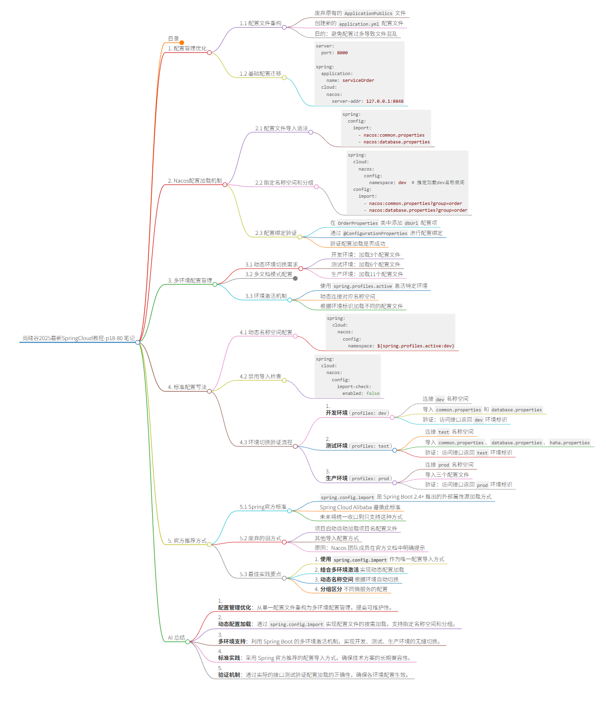

# 18、Nacos - 配置中心 - 数据隔离 - 动态切换环境


## 目录
- [1. 配置管理优化](#1-配置管理优化)
- [2. Nacos配置加载机制](#2-nacos配置加载机制)
- [3. 多环境配置管理](#3-多环境配置管理)
- [4. 标准配置写法](#4-标准配置写法)
- [5. 官方推荐方式](#5-官方推荐方式)
- [AI 总结](#ai-总结)

## 1. 配置管理优化

### 1.1 配置文件重构
- 废弃原有的 `Application.properties` 文件
- 创建新的 `application.yml` 配置文件
- 目的：避免配置过多导致文件混乱

### 1.2 基础配置迁移
```yaml
server:
  port: 8000

spring:
  application:
    name: service-order
  cloud:
    nacos:
      server-addr: 127.0.0.1:8848
```

## 2. Nacos配置加载机制

### 2.1 配置文件导入语法
```yaml
spring:
  config:
    import:
      - nacos:common.properties
      - nacos:database.properties
```

### 2.2 指定名称空间和分组
```yaml
spring:
  cloud:
    nacos:
      config:
        namespace: dev  # 指定加载dev名称空间
  config:
    import:
      - nacos:common.properties?group=order
      - nacos:database.properties?group=order
```

### 2.3 配置绑定验证
- 在 `Order.Properties` 类中添加 `dbUrl` 配置项
- 通过 `@ConfigurationProperties` 进行配置绑定
- 验证配置加载是否成功

## 3. 多环境配置管理

### 3.1 动态环境切换需求
- 开发环境：加载3个配置文件
- 测试环境：加载6个配置文件  
- 生产环境：加载11个配置文件

### 3.2 多文档模式配置
```yaml
# 默认配置
spring:
  cloud:
    nacos:
      config:
        namespace: ${spring.profiles.active:dev}

---
# 开发环境配置
spring:
  profiles: dev
  config:
    import:
      - nacos:common.properties
      - nacos:database.properties

---
# 测试环境配置  
spring:
  profiles: test
  config:
    import:
      - nacos:common.properties
      - nacos:database.properties
      - nacos:haha.properties

---
# 生产环境配置
spring:
  profiles: prod
  config:
    import:
      - nacos:common.properties
      - nacos:database.properties
      - nacos:haha.properties
```

### 3.3 环境激活机制
- 使用 `spring.profiles.active` 激活特定环境
- 动态连接对应名称空间
- 根据环境标识加载不同的配置文件

## 4. 标准配置写法

### 4.1 动态名称空间配置
```yaml
spring:
  cloud:
    nacos:
      config:
        namespace: ${spring.profiles.active:dev}
```

### 4.2 禁用导入检查
```yaml
spring:
  cloud:
    nacos:
      config:
        import-check:
          enabled: false
```

### 4.3 环境切换验证流程
1. **开发环境** (`profiles: dev`)
   - 连接 `dev` 名称空间
   - 导入 `common.properties` 和 `database.properties`
   - 验证：访问接口返回 `dev` 环境标识

2. **测试环境** (`profiles: test`)  
   - 连接 `test` 名称空间
   - 导入 `common.properties`、`database.properties`、`haha.properties`
   - 验证：访问接口返回 `test` 环境标识

3. **生产环境** (`profiles: prod`)
   - 连接 `prod` 名称空间
   - 导入三个配置文件
   - 验证：访问接口返回 `prod` 环境标识

## 5. 官方推荐方式

### 5.1 Spring官方标准
- `spring.config.import` 是 Spring Boot 2.4+ 推出的外部属性源加载方式
- Spring Cloud Alibaba 遵循此标准
- 未来将统一收口到只支持这种方式

### 5.2 废弃的旧方式
- 项目启动自动加载项目名配置文件
- 其他导入配置方式
- 原因：Nacos 团队成员在官方文档中明确提示

### 5.3 最佳实践要点
1. **使用 `spring.config.import`** 作为唯一配置导入方式
2. **结合多环境激活** 实现动态配置加载
3. **动态名称空间** 根据环境自动切换
4. **分组区分** 不同微服务的配置

## AI 总结

本视频详细讲解了 Spring Cloud 中 Nacos 配置中心的高级用法，重点包括：

1. **配置管理优化**：从单一配置文件重构为多环境配置管理，提高可维护性。

2. **动态配置加载**：通过 `spring.config.import` 实现配置文件的按需加载，支持指定名称空间和分组。

3. **多环境支持**：利用 Spring Boot 的多环境激活机制，实现开发、测试、生产环境的无缝切换。

4. **标准实践**：采用 Spring 官方推荐的配置导入方式，确保技术方案的长期兼容性。

5. **验证机制**：通过实际的接口测试验证配置加载的正确性，确保各环境配置生效。

这种配置管理方式为企业级微服务架构提供了灵活、可扩展的配置解决方案，是 Spring Cloud 项目中的最佳实践。