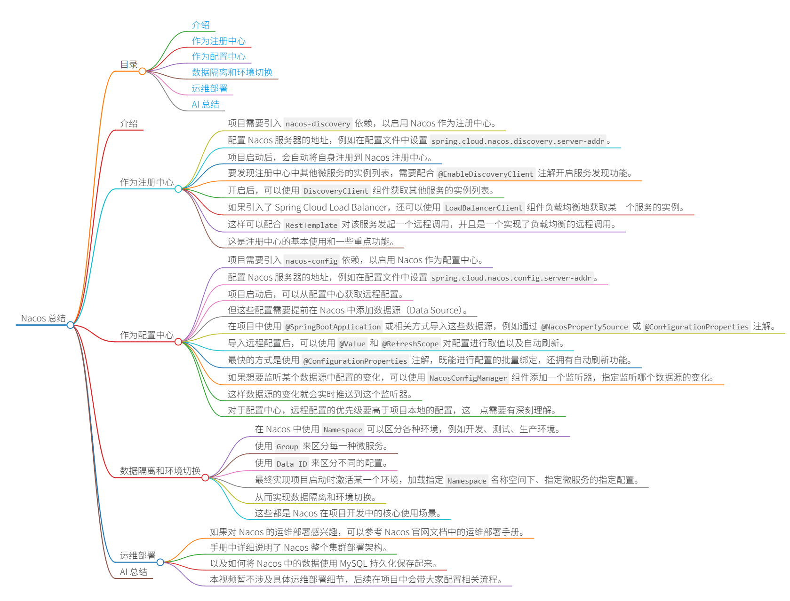

# Nacos 总结



## 目录
- [介绍](#介绍)
- [作为注册中心](#作为注册中心)
- [作为配置中心](#作为配置中心)
- [数据隔离和环境切换](#数据隔离和环境切换)
- [运维部署](#运维部署)
- [AI 总结](#ai-总结)

## 介绍
Nacos 是分布式系统中的注册中心（Service Registry）和配置中心（Configuration Center）。它提供了服务注册、发现、配置管理等功能，支持微服务架构中的数据管理和环境隔离。

## 作为注册中心
- 项目需要引入 `nacos-discovery` 依赖，以启用 Nacos 作为注册中心。
```java
<dependency>
    <groupId>com.alibaba.cloud</groupId>
    <artifactId>spring-cloud-starter-alibaba-nacos-discovery</artifactId>
</dependency>
```
- 配置 Nacos 服务器的地址，例如在配置文件中设置 `spring.cloud.nacos.discovery.server-addr`(如果只有一个Nacos集群，使用统一的 `spring.cloud.nacos.server-addr `)。
- 项目启动后，会自动将自身注册到 Nacos 注册中心。
- 要发现注册中心中其他微服务的实例列表，需要配合 `@EnableDiscoveryClient` 注解开启服务发现功能。
- 开启后，可以使用 `DiscoveryClient` 组件获取其他服务的实例列表。
- 如果引入了 Spring Cloud Load Balancer，还可以使用 `LoadBalancerClient` 组件负载均衡地获取某一个服务的实例。
- 这样可以配合 `RestTemplate` 对该服务发起一个远程调用，并且是一个实现了负载均衡的远程调用。
- 这是注册中心的基本使用和一些重点功能。

## 作为配置中心
- 项目需要引入 `nacos-config` 依赖，以启用 Nacos 作为配置中心。
```java
<dependency>
    <groupId>com.alibaba.cloud</groupId>
    <artifactId>spring-cloud-starter-alibaba-nacos-config</artifactId>
</dependency>
```
- 配置 Nacos 服务器的地址，例如在配置文件中设置 `spring.cloud.nacos.config.server-addr`(如果只有一个Nacos集群，使用统一的 `spring.cloud.nacos.server-addr `)。。
- 项目启动后，可以从配置中心获取远程配置。
- 但这些配置需要提前在 Nacos 中添加数据源（Data Source）。
- 在项目中使用 `@SpringBootApplication` 或相关方式导入这些数据源，例如通过 `@NacosPropertySource` 或 `@ConfigurationProperties` 注解。
- 导入远程配置后，可以使用 `@Value` 和 `@RefreshScope` 对配置进行取值以及自动刷新。
- 最快的方式是使用 `@ConfigurationProperties` 注解，既能进行配置的批量绑定，还拥有自动刷新功能。
- 如果想要监听某个数据源中配置的变化，可以使用 `NacosConfigManager` 组件添加一个监听器，指定监听哪个数据源的变化。
- 这样数据源的变化就会实时推送到这个监听器。
- 对于配置中心，远程配置的优先级要高于项目本地的配置，这一点需要有深刻理解。

## 数据隔离和环境切换
- 在 Nacos 中使用 `Namespace` 可以区分各种环境，例如开发、测试、生产环境。
- 使用 `Group` 来区分每一种微服务。
- 使用 `Data ID` 来区分不同的配置。
- 最终实现项目启动时激活某一个环境，加载指定 `Namespace` 名称空间下、指定微服务的指定配置。
- 从而实现数据隔离和环境切换。
- 这些都是 Nacos 在项目开发中的核心使用场景。

## 运维部署
- 如果对 Nacos 的运维部署感兴趣，可以参考 Nacos 官网文档中的运维部署手册。
- 手册中详细说明了 Nacos 整个集群部署架构。
- 以及如何将 Nacos 中的数据使用 MySQL 持久化保存起来。
- 本视频暂不涉及具体运维部署细节，后续在项目中会带大家配置相关流程。

## AI 总结
本视频总结了 Nacos 作为注册中心和配置中心的核心功能。在注册中心方面，强调了依赖引入、服务注册与发现、负载均衡和远程调用的集成；在配置中心方面，涵盖了配置管理、自动刷新、监听机制和优先级规则。此外，视频还解释了数据隔离通过 Namespace、Group 和 Data ID 的实现，以及环境切换的原理。对于运维部署，建议参考官方文档。整体上，Nacos 提供了完整的微服务支持，简化了分布式系统的开发和管理。