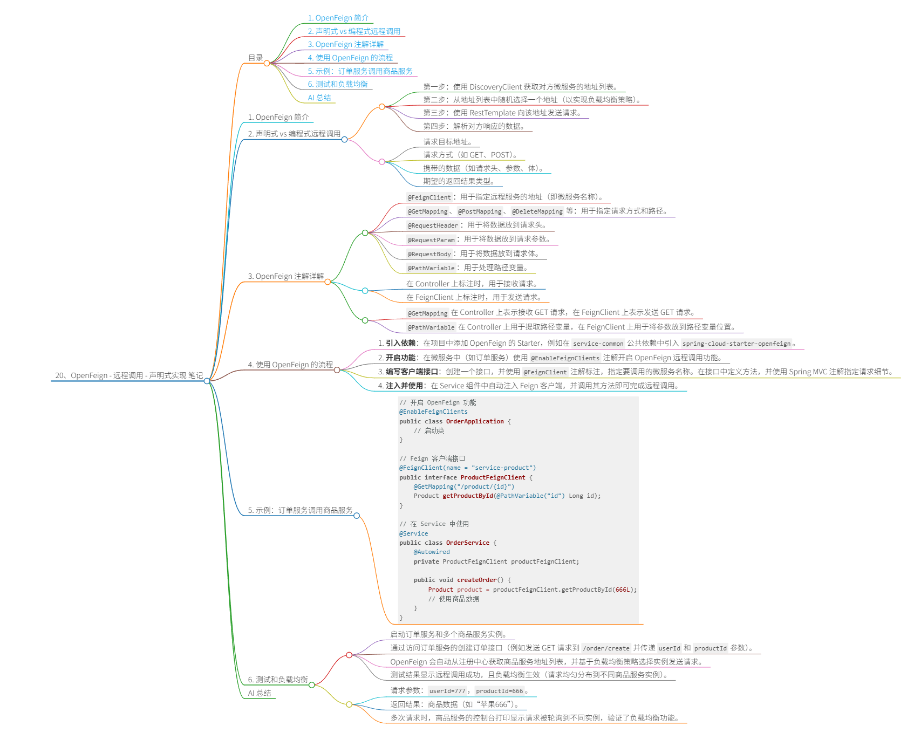

# 20、OpenFeign - 远程调用 - 声明式实现 笔记



## 目录
- [1. OpenFeign 简介](#1-openfeign-简介)
- [2. 声明式 vs 编程式远程调用](#2-声明式-vs-编程式远程调用)
- [3. OpenFeign 注解详解](#3-openfeign-注解详解)
- [4. 使用 OpenFeign 的流程](#4-使用-openfeign-的流程)
- [5. 示例：订单服务调用商品服务](#5-示例：订单服务调用商品服务)
- [6. 测试和负载均衡](#6-测试和负载均衡)
- [AI 总结](#ai-总结)

## 1. OpenFeign 简介
OpenFeign 是一个用于实现远程调用功能的组件，官方定义其为 Declarative REST Client，即声明式 REST 客户端。REST 客户端指的是能够发送 HTTP 请求以实现远程调用的工具。在之前学习 Nacos 注册中心时，曾使用过 RestTemplate，它是一种编程式的 REST 客户端，需要手动编码整个调用流程。而 OpenFeign 通过声明式方式简化了这一过程，用户只需通过注解明确指定请求目标、方式、数据等规则，OpenFeign 便会自动执行远程调用。

*Screenshot-[00:06]

## 2. 声明式 vs 编程式远程调用
编程式远程调用需要手动编码整个流程，例如使用 RestTemplate 时：
- 第一步：使用 DiscoveryClient 获取对方微服务的地址列表。
- 第二步：从地址列表中随机选择一个地址（以实现负载均衡策略）。
- 第三步：使用 RestTemplate 向该地址发送请求。
- 第四步：解析对方响应的数据。

这种方式较为繁琐。而声明式远程调用无需编码整个流程，只需通过注解告诉 OpenFeign：
- 请求目标地址。
- 请求方式（如 GET、POST）。
- 携带的数据（如请求头、参数、体）。
- 期望的返回结果类型。

OpenFeign 会自动根据这些规则发送请求，简化了开发流程。

*Screenshot-[00:32]

## 3. OpenFeign 注解详解
OpenFeign 使用一系列注解来实现声明式远程调用，其中部分注解复用了 Spring MVC 的注解，以减少学习成本。主要注解包括：
- `@FeignClient`：用于指定远程服务的地址（即微服务名称）。
- `@GetMapping`、`@PostMapping`、`@DeleteMapping` 等：用于指定请求方式和路径。
- `@RequestHeader`：用于将数据放到请求头。
- `@RequestParam`：用于将数据放到请求参数。
- `@RequestBody`：用于将数据放到请求体。
- `@PathVariable`：用于处理路径变量。

需要注意的是，这些注解在 OpenFeign 客户端上的作用与在 Controller 上不同：
- 在 Controller 上标注时，用于接收请求。
- 在 FeignClient 上标注时，用于发送请求。

例如：
- `@GetMapping` 在 Controller 上表示接收 GET 请求，在 FeignClient 上表示发送 GET 请求。
- `@PathVariable` 在 Controller 上用于提取路径变量，在 FeignClient 上用于将参数放到路径变量位置。

*Screenshot-[01:30]

## 4. 使用 OpenFeign 的流程
使用 OpenFeign 实现远程调用的基本流程如下：
1. **引入依赖**：在项目中添加 OpenFeign 的 Starter，例如在 `service-common` 公共依赖中引入 `spring-cloud-starter-openfeign`。
2. **开启功能**：在微服务中（如订单服务）使用 `@EnableFeignClients` 注解开启 OpenFeign 远程调用功能。
3. **编写客户端接口**：创建一个接口，并使用 `@FeignClient` 注解标注，指定要调用的微服务名称。在接口中定义方法，并使用 Spring MVC 注解指定请求细节。
4. **注入并使用**：在 Service 组件中自动注入 Feign 客户端，并调用其方法即可完成远程调用。

*Screenshot-[02:55]

## 5. 示例：订单服务调用商品服务
以订单服务调用商品服务为例，具体实现步骤如下：
- **场景**：订单服务在创建订单时，需要远程获取商品数据（通过商品 ID）。
- **原有方式**：使用 RestTemplate 手动实现远程调用和负载均衡。
- **OpenFeign 实现**：
  - 在订单服务中创建 Feign 客户端接口 `ProductFeignClient`。
  - 使用 `@FeignClient(name = "service-product")` 指定调用的商品服务名称。
  - 在接口中定义方法 `getProductById`，使用 `@GetMapping("/product/{id}")` 指定请求路径和方法，并使用 `@PathVariable` 将参数绑定到路径变量。
  - 在订单服务的 Controller 或 Service 中注入 `ProductFeignClient`，并调用 `getProductById` 方法。

代码示例：
```java
// 开启 OpenFeign 功能
@EnableFeignClients
public class OrderApplication {
    // 启动类
}

// Feign 客户端接口
@FeignClient(name = "service-product")
public interface ProductFeignClient {
    @GetMapping("/product/{id}")
    Product getProductById(@PathVariable("id") Long id);
}

// 在 Service 中使用
@Service
public class OrderService {
    @Autowired
    private ProductFeignClient productFeignClient;
    
    public void createOrder() {
        Product product = productFeignClient.getProductById(666L);
        // 使用商品数据
    }
}
```

*Screenshot-[04:58]

## 6. 测试和负载均衡
测试 OpenFeign 远程调用：
- 启动订单服务和多个商品服务实例。
- 通过访问订单服务的创建订单接口（例如发送 GET 请求到 `/order/create` 并传递 `userId` 和 `productId` 参数）。
- OpenFeign 会自动从注册中心获取商品服务地址列表，并基于负载均衡策略选择实例发送请求。
- 测试结果显示远程调用成功，且负载均衡生效（请求均匀分布到不同商品服务实例）。

例如：
- 请求参数：`userId=777`，`productId=666`。
- 返回结果：商品数据（如“苹果666”）。
- 多次请求时，商品服务的控制台打印显示请求被轮询到不同实例，验证了负载均衡功能。

*Screenshot-[09:17]

## AI 总结
本视频详细介绍了 OpenFeign 作为声明式 REST 客户端在微服务远程调用中的应用。通过对比编程式（如 RestTemplate）和声明式调用，突出了 OpenFeign 的简化优势：用户只需通过注解（如 `@FeignClient`、`@GetMapping`）定义请求规则，即可自动完成服务发现、负载均衡和请求发送。视频以订单服务调用商品服务为例，演示了从依赖引入、客户端编写到测试的完整流程，强调了注解的双重逻辑（发送 vs 接收）和负载均衡的自动实现。OpenFeign 有效提升了开发效率和代码可读性，是微服务架构中远程调用的理想选择。